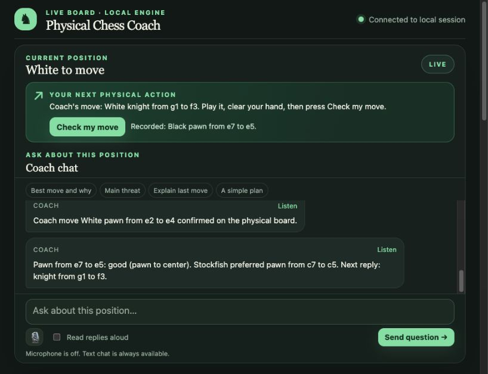
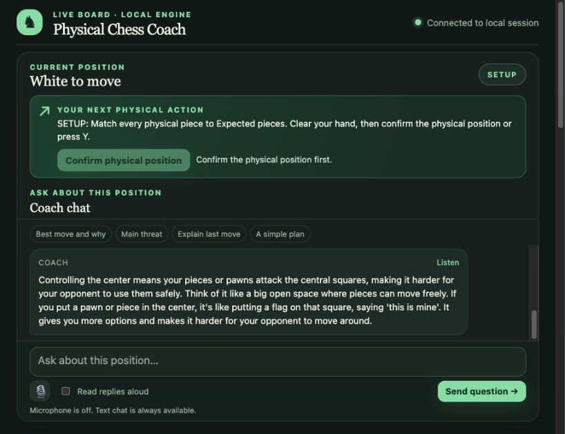
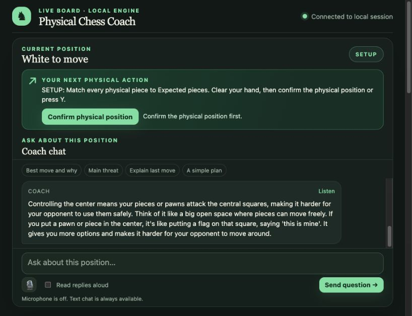
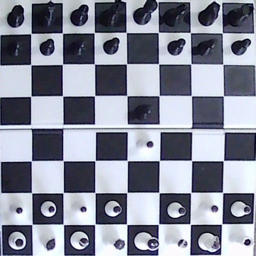
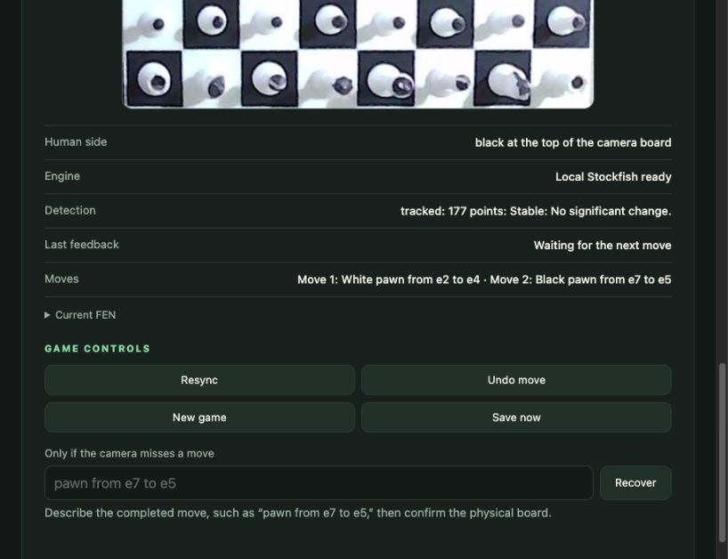
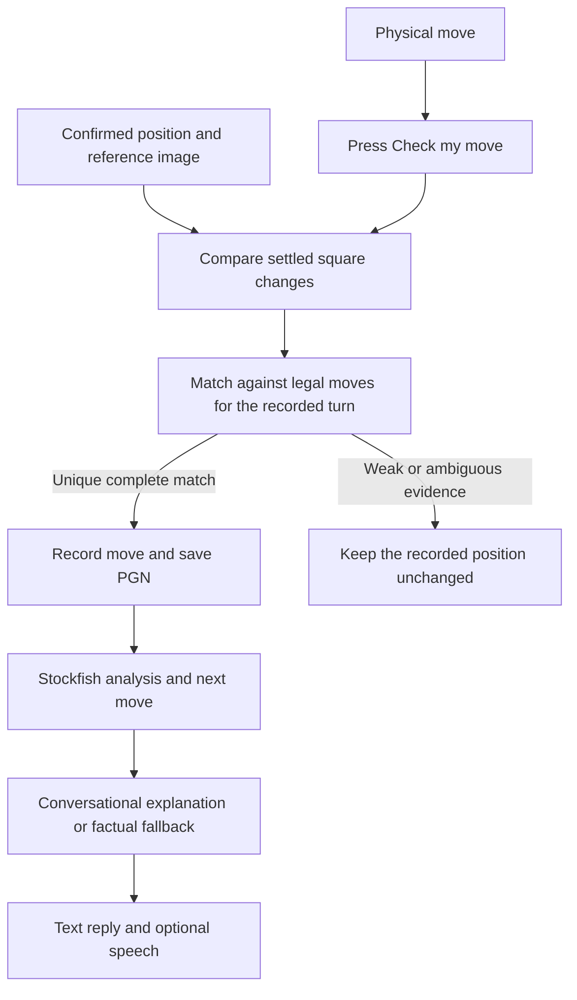

# ChessAICoach

Learn chess on a **physical board** with camera move checks, local Stockfish analysis, and a coach you can ask questions as you play.

Move a piece, clear your hand, and press **Check my move**. The app compares the camera view with the last confirmed position, records a matching legal move, and tells you what to do next. Instructions use ordinary language such as **“White knight from g1 to f3.”** Text explanations are the primary interface; microphone input and spoken replies are optional.



*An actual session: Black's pawn from e7 to e5 has been recorded, and the coach asks for White's knight from g1 to f3.*

## Features

- **Physical board play:** a webcam view is rectified into a board view, with tracking and manual corner calibration.
- **One button per move:** each **Check my move** request checks fresh, settled frames and records at most one move.
- **Legal position tracking:** ordinary moves, captures, castling, en passant, and promotion candidates are checked against the recorded position and turn.
- **Plain language guidance:** moves, move history, and recovery input use piece names and squares.
- **Local chess analysis:** Stockfish suggests moves, reviews your moves, and supplies analysis for coaching.
- **Conversational explanations:** an optional local Ollama model answers follow-up questions using chess evidence and recent conversation.
- **Optional voice:** local whisper.cpp transcription and macOS read-aloud, with editable transcripts and visible text replies.
- **Recovery and persistence:** resync, undo, new game, manual recovery, automatic PGN saves, and camera diagnostics.

**Current platform:** macOS. The camera uses OpenCV's AVFoundation backend, and the bundled voice setup uses macOS speech tools. Python 3.11 was used for verification. Windows and Linux would require camera and speech integration changes.

## Contents

- [Screenshots](#screenshots)
- [Requirements](#requirements)
- [Quick start](#quick-start)
- [Camera setup and calibration](#camera-setup-and-calibration)
- [Playing a game](#playing-a-game)
- [Talking to the coach](#talking-to-the-coach)
- [Optional voice](#optional-voice)
- [Controls and recovery](#controls-and-recovery)
- [Save and resume](#save-and-resume)
- [Configuration](#configuration)
- [How recognition works](#how-recognition-works)
- [Troubleshooting](#troubleshooting)
- [Local data and privacy](#local-data-and-privacy)
- [Project structure](#project-structure)
- [Tests and verification](#tests-and-verification)

## Screenshots

These captures come from the local app and physical board sessions on October 4, 2026. Suggestions and chat replies depend on the current position; the examples shown here are not a fixed script.

<details>
<summary><strong>Starting position confirmation</strong></summary>



The app waits while you compare the physical board with **Expected pieces**. Confirming records the reference image for that position.

</details>

<details>
<summary><strong>Conversational coaching</strong></summary>



Ask why a move helps, then ask for a simpler explanation or explore another legal move. **Listen** and **Read replies aloud** are available alongside the text.

</details>

<details>
<summary><strong>Physical board camera view</strong></summary>



The camera view after the two pawn moves. Dark marks on the pale pieces provide contrast. The image is also part of the captured-board regression test for a dark pawn on a dark square.

</details>

<details>
<summary><strong>Move history and recovery controls</strong></summary>



The side panel shows the recorded moves, engine and detection status, and recovery controls. A missed move can be entered as **“pawn from e7 to e5.”**

</details>

## Requirements

| Component | Purpose | Required? |
| --- | --- | --- |
| macOS with a graphical desktop | Camera backend and supporting OpenCV windows | Yes |
| Python 3.11 | Verified Python runtime | Yes |
| Webcam and physical 8×8 chessboard | Board images and physical play | Yes |
| NumPy, OpenCV, python-chess | Image processing and legal move validation | Yes; installed by setup |
| Stockfish | Move suggestions and evaluations | For engine coaching; tracking can run without it |
| Homebrew | Convenient installation of Stockfish and voice tools | For the bundled dependency installation steps |
| Ollama and a local model | Flexible conversational wording | Optional; factual explanations are the fallback |
| whisper.cpp and an English model | Local microphone transcription | Optional |
| macOS `say` and FFmpeg | Local spoken replies | Optional |

A browser displays the local dashboard. You can use Codex's built-in browser or another browser on the same Mac. The Python process captures the webcam; the dashboard displays its images. No VS Code camera integration or cloud API key is needed.

## Quick start

### 1. Clone the repository

```bash
git clone https://github.com/ChanakyaG2004/ChessAICoach.git
cd ChessAICoach
```

Install Python and [Homebrew](https://brew.sh/) first if they are not available on your Mac.

### 2. Install the Python dependencies and Stockfish

```bash
bash scripts/setup.sh
```

This creates `.venv/`, installs `requirements.txt`, and installs Stockfish when Homebrew is available. If Homebrew is absent, the script prints instructions to provide an engine path.

The equivalent manual steps are:

```bash
python3 -m venv .venv
source .venv/bin/activate
python -m pip install -r requirements.txt
brew install stockfish
```

Stockfish is discovered through standard executable locations. To use another installation, pass `--engine-path /path/to/stockfish` or set `STOCKFISH_EXECUTABLE`.

### 3. Start the app

The bundled launcher uses the camera orientation tested for this project:

```bash
./Start\ Chess\ Coach.command
```

It puts Black at the top of the rotated view and makes Black the human side. In this arrangement, the coach plays White and provides the first move.

For a board already upright in the camera, with White at the bottom and Black at the top:

```bash
./.venv/bin/python main.py --top-color black --board-rotation none
```

Choose your orientation using the [camera setup guide](#camera-setup-and-calibration). The launcher accepts extra options, such as `--camera-index 1`, but its side and rotation defaults suit the tested arrangement.

### 4. Open the dashboard and confirm setup

Open **http://127.0.0.1:8765/** on the same Mac. The terminal prints the address when the app starts.

1. Arrange the standard starting position on the physical board.
2. Check the **Physical camera** view and board outline.
3. Select **Expected pieces** and compare every physical piece with the displayed position.
4. Clear your hand and press **Confirm physical position** when it becomes available.
5. Read **Your next physical action** before moving a piece.

The app also opens **Camera - board outline** and **Physical Chess Coach** windows. Keep the Python process running while using the dashboard. Press `q` in a supporting window to quit and release the camera.

## Camera setup and calibration

### Board visibility

- Keep all four outer corners and all 64 squares in view.
- Use a stable camera mount and an angle that leaves the playing surface visible around tall pieces.
- Aim for even lighting; avoid strong glare and deeply shadowed squares.
- Keep your hand clear while confirming a position or checking a move.
- Recalibrate after moving the board or camera.

The app requests 1920×1080 capture and a high frame rate. It checks early frames and can request 30 FPS when a higher rate gives severely underexposed images. Actual resolution, frame rate, and brightness are printed at startup and depend on the camera.

### Orientation and human side

`--board-rotation` rotates the rectified image. `--top-color` describes the side at the top **after that rotation** and also selects the human side.

| Camera arrangement | Rotation | Top color / human side |
| --- | --- | --- |
| Black already at top, White at bottom | `none` | `black` |
| White already at top, Black at bottom | `none` | `white` |
| Black at left, White at right, as in the tested setup | `cw` | `black` |

Other arrangements can use `ccw` or `half`. Inspect the rotated view and compare it with **Expected pieces** before confirming. If `--top-color` is omitted, the terminal asks for it.

For example, to play White with White at the top of an upright camera view:

```bash
./.venv/bin/python main.py --top-color white --board-rotation none
```

### Manual corner calibration

If automatic board detection misses the playing surface:

1. Focus **Camera - board outline**.
2. Press `c`.
3. Click the four **outer corners of the playing surface**, in any order.
4. Inspect the new outline and rectified board.
5. Compare the physical pieces with **Expected pieces**, then confirm the position.

For a fixed setup, you can supply four camera pixel coordinates at launch:

```bash
./.venv/bin/python main.py --top-color black --board-rotation cw \
  --corners 560,322 1063,384 1009,883 458,808
```

These are example coordinates from one capture, not calibration values for every camera. Use corners measured from your own image.

## Playing a game

### The normal move loop

1. **Read the instruction.** The app shows whose turn it is and the next physical action.
2. **Make one complete move.** On your turn, choose a legal move. On the coach's turn, move the displayed piece yourself.
3. **Remove your hand.** Let the board settle.
4. **Press Check my move.** A check uses fresh frames collected after the press.
5. **Wait for Recorded.** Confirm that the named piece and destination match your move before making another move.
6. **Read the feedback or ask a question.** Accepted moves are saved, your moves are reviewed, and the next instruction is displayed.

**Moves are recorded only after a check request.** There is no continuous automatic recording while the app is idle. A failed check, no change, or timeout ends the request; correct the problem and press the button again.

You physically move pieces for both sides. The coach gives instructions and never moves a real piece. If you play a different legal move for the coach's side, the app follows the actual recorded move and notes the difference.

### Example opening

With Black as the human side, a session might proceed like this:

| Step | Physical action | Dashboard action |
| --- | --- | --- |
| Setup | Arrange all pieces at their starting squares | Confirm physical position |
| Coach / White | Follow the suggested move, for example pawn from e2 to e4 | Clear your hand, then Check my move |
| Human / Black | Choose a legal reply, for example pawn from e7 to e5 | Clear your hand, then Check my move |
| Coach / White | Follow the next suggestion, for example knight from g1 to f3 | Clear your hand, then Check my move |

The engine may suggest different moves in another session or position.

### Special moves

- **Capture:** move the attacking piece and remove the captured piece before checking.
- **Castling:** move both the king and rook before checking. A rook moved first can resemble an ordinary rook move; complete the castle or explicitly confirm the displayed rook move.
- **En passant:** remove the captured pawn as part of the complete move before checking.
- **Promotion:** move the pawn and replace it with the chosen piece, then check and select **Queen**, **Rook**, **Bishop**, or **Knight** when prompted.

The app rejects a clear move by the wrong side and does not update the recorded position for weak, incomplete, or ambiguous evidence.

## Talking to the coach

Type a question and press **Send question**. You can use the suggested prompts or ask in your own words:

- “What is the best move here, and why?”
- “Why should I move that pawn?”
- “What does controlling the center mean?”
- “Explain that more simply.”
- “Why not move a knight first?”
- “What if I move my knight to f3?”
- “What is my opponent threatening?”
- “How was my last move?”

Stockfish provides move analysis. The conversation layer supplies facts about the position, legal alternatives, and move effects. An optional local language model turns those facts and recent conversation into an answer to your question. Asking a hypothetical question does not play or record a move.

The coach has access to the currently displayed move and feedback. Replies use recent conversation for follow-ups, while older positions are treated as history. A response that becomes stale because the recorded position changes is marked accordingly.

### Enable local conversational generation

Install and open Ollama using its [official quick start](https://docs.ollama.com/quickstart). Download the model configured by this app:

```bash
ollama pull llama3.1:latest
ollama ls
```

Keep Ollama running while using the coach. If no local server is running, start it in a separate terminal:

```bash
ollama serve
```

The app calls `http://127.0.0.1:11434/api/chat` and defaults to `llama3.1:latest`. Model files are downloaded separately and are not bundled with this repository. See the [Ollama CLI reference](https://docs.ollama.com/cli) for the download and server commands.

To select another locally installed model, set its exact name **before launching the app**:

```bash
CHESS_COACH_MODEL=llama3.1:latest ./.venv/bin/python main.py \
  --top-color black --board-rotation cw
```

The model's structured response is checked against supplied facts and allowed moves. If Ollama is unavailable, times out, or returns an answer that fails those checks, factual explanations remain available. This validation does not guarantee that every explanation is correct.

To use the factual response path directly:

```bash
./.venv/bin/python main.py --top-color black --board-rotation cw \
  --no-language-model
```

## Optional voice

Voice is **off by default**. Text questions and replies remain available without installing voice dependencies or granting microphone access.

### Install local voice tools

```bash
bash scripts/setup_voice.sh
```

The macOS setup script installs whisper.cpp and FFmpeg through Homebrew if needed, downloads the English `base.en` model into `models/`, and verifies its checksum. Installation and downloads happen during this explicit setup step. Restart the coach after setup.

### Ask a spoken question

1. Click the microphone button.
2. Allow microphone access when prompted.
3. Speak a short question, up to 30 seconds.
4. Click the microphone again to stop.
5. Review or edit the transcript in the question box.
6. Press **Send question**.

The transcript is not sent as a question until you submit it. Camera access for Python and microphone access for the browser are separate permissions.

### Hear a reply

- Click **Listen** on one reply to hear it.
- Enable **Read replies aloud** to hear new replies automatically.
- Use **Stop speaking** to stop playback.

The server's read-aloud path uses macOS `say` and FFmpeg. A local browser voice can also be used when available. Text remains visible throughout. Custom transcription paths can be set with `WHISPER_EXECUTABLE` and `WHISPER_MODEL_PATH`.

## Controls and recovery

Recovery actions require the physical board to match the displayed target before confirmation. **Expected pieces** shows that target during undo, new game, and manual recovery; the recorded game changes only when the action is confirmed.

### Dashboard controls

| Control | What to do | Effect |
| --- | --- | --- |
| Confirm physical position | Match every piece with Expected pieces and clear your hand | Records a stable reference for setup or confirms a pending recovery |
| Check my move | Complete one move and clear your hand | Attempts to record one matching legal move |
| Physical camera / Expected pieces | Switch between the real image and recorded or recovery target position | Helps you compare the two boards |
| Resync | Restore the physical board to the **current recorded position**, then confirm | Refreshes the image reference; does not add a move |
| Undo move | Restore the previous position shown in Expected pieces, then confirm | Removes the last recorded move and refreshes the reference |
| New game | Arrange the standard starting position, then confirm | Starts a new game and PGN |
| Save now | Press while the app is running | Saves the PGN and local diagnostic images and metadata |
| Recover | Enter a missed legal move, compare with the target, then confirm | Records that manually supplied move and refreshes the reference |
| Cancel | Cancel a pending recovery | Leaves the recorded game unchanged |

### Recover a missed move

If retrying **Check my move** still fails for a completed legal move:

1. Leave the physical board in the position after that move.
2. In **Only if the camera misses a move**, enter a description such as `pawn from e7 to e5`.
3. Press **Recover**.
4. Compare the physical board with **Expected pieces**, including every unaffected piece.
5. Clear your hand and press **Confirm physical position**.

The input must describe a legal move for the recorded side to move. Recovery is an explicit statement by you about what happened; the camera does not independently identify every piece during confirmation. **Resync alone never records a missed move.**

### Keyboard controls

Focus a supporting OpenCV window before using these keys. Keyboard manual entry uses UCI, such as `e2e4`; the browser supports plain language.

| Key | Action |
| --- | --- |
| `Space` | Check one completed physical move |
| `q` | Quit and release camera and engine resources |
| `c` | Click four outer board corners for calibration |
| `y` | Confirm the physical setup or a pending recovery |
| `Esc` | Cancel a pending recovery or manual entry |
| `r` | Request resync |
| `u` | Request undo |
| `n` | Request a new standard game |
| `m` | Enter a missed legal move in UCI; Enter validates, then `y` confirms |
| `s` | Save the game and camera diagnostics |
| `1`, `2`, `3`, `4` | Choose queen, rook, bishop, or knight for a detected promotion |
| `Enter` | Confirm a displayed rook move that could be an unfinished castle |

While typing a manual move, press Esc before using other hotkeys.

## Save and resume

Accepted moves are saved automatically to `games/game_<timestamp>.pgn` beside `main.py`. A PGN stores the initial position, human color, accepted move history, and current position. The file is replaced atomically, and inconsistent or damaged history is rejected on load.

To continue a game:

1. Find its PGN in `games/`.
2. Launch with `--resume` using that file's actual name.
3. Arrange the physical board to match the saved **final position** shown in Expected pieces.
4. Verify the outline, clear your hand, and confirm the position.

```bash
./.venv/bin/python main.py \
  --resume games/game_YYYYMMDD_HHMMSS_microseconds.pgn \
  --board-rotation cw
```

The saved human side is restored automatically. A conflicting `--top-color` is rejected. `--resume` and `--fen` cannot be combined. A fresh image reference is recorded for the resumed position; the existing PGN continues to be updated.

Choose another output path with `--save-pgn /path/to/game.pgn`. Chat history stays in memory for the current app session and is not restored from PGN.

For a known custom starting position, supply its full FEN:

```bash
./.venv/bin/python main.py --top-color black --board-rotation cw \
  --fen "r3k2r/8/8/8/8/8/8/R3K2R w KQkq - 0 1"
```

FEN specifies piece placement, whose turn it is, castling rights, en passant, and move counters. You must arrange and confirm that physical position yourself.

## Configuration

Run `./.venv/bin/python main.py --help` for the command-line reference. Unless you use the launcher, the default rotation is `none` and the top color is requested interactively when omitted.

| Option | Default | Purpose |
| --- | --- | --- |
| `--top-color white\|black` | Prompt, or saved side when resuming | Human side at the top of the rotated image |
| `--board-rotation none\|cw\|ccw\|half` | `none` | Rotate the rectified board |
| `--camera-index N` | `0` | Select the OpenCV camera device |
| `--corners X,Y X,Y X,Y X,Y` | Automatic detection | Supply four outer board corners in camera pixels |
| `--stable-seconds N` | `0.9` | Time required for a stable board view |
| `--change-threshold N` | `0.07` | Base square-change evidence threshold |
| `--analysis-time N` | `0.25` | Stockfish search time in seconds for move coaching |
| `--engine-path PATH` | Auto-discovered | Use a specific Stockfish executable |
| `--chat-port N` | `8765` | Local dashboard port; `0` selects an available port |
| `--fen FEN` | Standard starting position | Start from a known custom position |
| `--resume PATH` | New game | Resume a validated PGN |
| `--save-pgn PATH` | Timestamped file in `games/` | Choose the saved game's path |
| `--no-engine` | Engine enabled when available | Run tracking without Stockfish coaching |
| `--no-language-model` | Ollama attempted | Use factual conversation responses |
| `--no-chat` | Dashboard enabled | Use only the supporting desktop windows |
| `--debug-windows` | Off | Open image-processing and move-score diagnostics |
| `--assume-setup` | Off | Skip initial setup confirmation for an already checked position; manual corner calibration still requires confirmation |

Environment variables: `CHESS_COACH_MODEL` selects the Ollama model, `STOCKFISH_EXECUTABLE` selects an engine, and `WHISPER_EXECUTABLE` / `WHISPER_MODEL_PATH` configure local transcription.

Keep the defaults until you understand a detection failure. Increasing `--stable-seconds 1.5` can help with slow hand removal. Inspect saved diagnostics before changing the evidence threshold.

## How recognition works



1. The board detector and tracker locate the playing surface. Perspective warping produces a rectified image.
2. Setup confirmation records an image reference for a **known chess position**.
3. A check waits for fresh stable frames, aligns them to the reference, and compares local image detail. Denoising reduces speckle on dark squares; local brightness processing reduces broad shadow effects.
4. Legal candidate moves predict which squares should change, including extra squares for castling and en passant.
5. One sufficiently clear, complete match advances the position and becomes the new reference. Unreliable geometry or insufficient evidence leaves the game unchanged.
6. Stockfish analyzes the recorded position; conversational and voice layers present that analysis to you.

### Does it recognize a pawn versus a knight?

The current system **tracks pieces from the confirmed position**. It does not classify arbitrary piece identities from an unknown image. If the recorded position has a pawn on e2 and a unique legal change matches e2 to e4, the move is named as a pawn move because the app already knows what was on e2.

Small black dots on pale pieces can improve visual contrast, but identical dots do not encode piece type. Replacing a piece without recording the change can put the physical and recorded boards out of sync. Initial setup and recovery confirmations depend on your piece-by-piece comparison.

### Practical limits

Tall pieces, glare, low light, strong shadows, low-contrast captures, a moved camera, or stationary obstructions can confuse the comparison. Multiple moves before one is recorded can also invalidate the reference. The app pauses or rejects unclear evidence, but its image scores and visual fit are heuristics, not calibrated probabilities.

Engine suggestions and conversational explanations depend on the **recorded** position. Stockfish cannot repair an incorrect physical setup, and a short engine search does not guarantee perfect play. Physical validation has been performed on one board and camera arrangement; other setups may need calibration.

## Troubleshooting

| Symptom | What to check or do |
| --- | --- |
| Dashboard cannot connect | Keep `main.py` running and use the address printed in the terminal. For a busy port, use `--chat-port 8766` or `--chat-port 0`. |
| NumPy or OpenCV import fails | Launch with `./.venv/bin/python`, not an unrelated global Python installation. If needed, reinstall `requirements.txt` with that environment's `python -m pip`. |
| Webcam will not open | Grant camera access to the application launching Python under macOS System Settings → Privacy & Security → Camera. Close other apps using that device and try `--camera-index N`. A restricted execution environment may also need camera access. |
| Board outline is missing or wrong | Keep all corners visible, improve lighting, and use `c` to select the outer corners. Recheck orientation and confirm the expected position. |
| Confirm or Check button is disabled | Setup or recovery may still be pending, the view may not be stable, tracking may be unreliable, or a check may already be running. Read the displayed status. |
| “No move found” | Complete one move, clear your hand, and check again. Make sure the physical board actually differs from the last recorded position. |
| “Could not recognize one complete legal move” | Verify the side to move, source and destination, captured pieces, lighting, and camera view. Retry after the board settles; save diagnostics if it persists. |
| Black piece disappears into a dark square | Improve even lighting and camera exposure. Inspect both the source and destination in the camera view. The matcher includes denoising and captured-board regression coverage for this case. |
| An out-of-turn move is rejected | Restore the last recorded physical position and move the side named on screen. |
| Camera or board moved | Recalibrate corners, restore the current recorded position, and confirm a resync. |
| A legal move remains unrecognized | Use the browser's Recover field for that move and confirm the displayed target. Resync refreshes a reference and does not add a move. |
| Coach gives only factual or short responses | Check that Ollama is running and `llama3.1:latest` is installed, or set `CHESS_COACH_MODEL` to an installed model. Failed model requests fall back to factual responses. |
| Stockfish is unavailable | Install it, verify its executable path, and use `--engine-path` if needed. Tracking continues without engine coaching. |
| Microphone control is unavailable | Run `bash scripts/setup_voice.sh`, restart the coach, and check browser microphone permission and the displayed voice status. |
| Read-aloud is unavailable | Check FFmpeg and macOS speech availability, or a local browser voice. Text remains available. |
| Keyboard shortcuts do nothing | Focus a supporting OpenCV window. Browser text fields capture typing. |
| Saved game is rejected | Check that the file is a complete PGN produced by the app and has consistent setup and move history. Resume a valid copy rather than guessing the position. |

### Collect a useful recognition report

Press **Save now** or `s`. A timestamped group in `debug_captures/` contains the camera frame, rectified board, accepted reference, available comparison frame, supporting diagnostic images, and JSON with the FEN, corners, status, and square scores.

When reporting a failure, include the source and destination, the side to move, the recorded position, the displayed error, and relevant board images. Review camera images before sharing them because the raw frame can include the area around your board.

## Local data and privacy

| Data | Location or lifetime |
| --- | --- |
| Accepted game history | `games/*.pgn`, saved automatically |
| Diagnostic images and metadata | `debug_captures/`, saved on request |
| Chat history | Memory for the current app session |
| Microphone recordings and generated server speech | Temporary files removed after processing |
| English transcription model | `models/ggml-base.en.bin` |
| Ollama models | Managed separately by Ollama |

The dashboard binds to `127.0.0.1`; it is not a remotely hosted chess service. Board processing, Stockfish, the default local Ollama model, and bundled voice processing run on your Mac. Initial dependency and model setup downloads require internet access. Custom speech integrations or model choices can have different behavior.

`.venv/`, `models/`, `games/`, and `debug_captures/` are excluded from Git. The repository deliberately includes selected documentation screenshots and board-only regression fixtures. Publishing the repository does not publish your running dashboard or automatically upload future games and camera captures.

## Project structure

```text
ChessAICoach/
├── main.py                 # Camera loop, calibration, controls, and application startup
├── board_detector.py       # Board geometry detection and feature tracking
├── perspective.py          # Corner ordering, board warping, and rotation
├── move_detector.py        # Stability, visual evidence, and legal move matching
├── move_language.py        # Plain language move descriptions and recovery input
├── game_controller.py      # Accepted moves, coaching, recovery, and saves
├── coach.py                # Stockfish analysis and move review
├── conversation.py         # Questions, verified position facts, and follow-up context
├── coach_language.py       # Local Ollama writing and response validation
├── web_coach.py            # Loopback HTTP server, chat worker, and action queue
├── web/                    # Browser interface, styles, and optional voice controls
├── speech.py               # Local transcription and server read-aloud
├── session_store.py        # Atomic PGN writes and validated loading
├── recovery.py             # Stable-frame confirmation for setup and recovery
├── coach_ui.py             # Supporting desktop coach window
├── scripts/                # Dependency and optional voice setup
├── docs/screenshots/       # README screenshots
├── test_fixtures/          # Captured-board recognition regression images
└── test_*.py               # Automated tests
```

## Tests and verification

Run the complete suite from the repository root after installing dependencies:

```bash
./.venv/bin/python -m unittest discover -v
```

Run the move detector tests alone:

```bash
./.venv/bin/python -m unittest -v test_move_detector
```

**Last full-suite verification:** 105 tests passed on October 4, 2026. This is a recorded local result, not a continuous integration badge.

Coverage includes board geometry, legal move footprints, both orientations, button-gated recording, shadows, marked pale pieces, a captured dark-pawn failure, incomplete and out-of-turn moves, promotion choices, recovery, PGN validation, engine analysis, chat context, stale responses, HTTP controls, and bounded voice processing.

The captured-board regression checks Black's pawn from e7 to e5 after White's pawn from e2 to e4. It also verifies that a lifted pawn without a visible destination does not advance the game. Live camera checks verified those two pawn moves on the tested board. Automated tests do not replace validation with another camera, board, or lighting setup.

HTTP tests bind to loopback and therefore need local networking permission in a restricted execution environment. Bundled voice tests use controlled inputs; microphone permission is not needed merely to run the suite.
